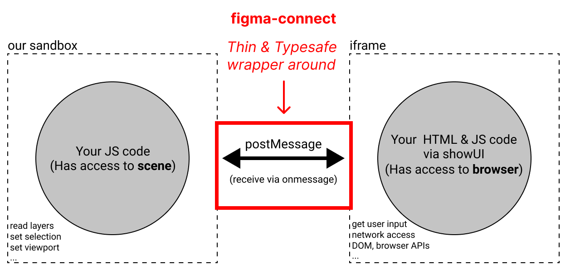

# `figma-connect`
> Status: Experimental

A straightforward and typesafe wrapper around the communication between the `app/ui` (iframe) and `plugin` (sandbox) part of a Figma Plugin.



[Source](https://www.figma.com/plugin-docs/how-plugins-run/)

### Motivation

Provide a typesafe and straightforward wrapper around the communication between the `app/ui` and `plugin` part of a Figma Plugin.

### Alternatives

- [figma-messenger](https://github.com/okotoki/figma-messenger)

### Used by
- [dyn.art - Figma Plugin](https://github.com/dyn-art/monorepo/tree/develop/apps/figma-plugin)

# 📖 Usage

### Shared Types

Define types for events to be shared between the Figma app and plugin.

`shared.ts`
```ts
import { type TFromPluginMessageEvent } from 'figma-connect/plugin';
import { type TFromAppMessageEvent } from 'figma-connect/app';

// Plugin Events (Plugin -> App)
interface TOnSelectNodeEvent extends TFromPluginMessageEvent {
    key: 'on-select-node';
    args: { selected: Pick<SceneNode, 'name' | 'id'>[] };
}

interface TOnDeselectNodeEvent extends TFromPluginMessageEvent {
    key: 'on-deselect-node';
    args: { deselected: Pick<SceneNode, 'name' | 'id'>[] };
}

type TFromPluginMessageEvents = TOnSelectNodeEvent | TOnDeselectNodeEvent;

// App Events (App -> Plugin)
interface TOnUIRouteChangeEvent extends TFromAppMessageEvent {
    key: 'on-ui-route-change';
    args: {
        activeRoute: 'a' | 'b' | 'c';
    };
}

interface TOnUserLoginEvent extends TFromAppMessageEvent {
    key: 'on-user-login';
    args: {
        userId: string;
        timestamp: number;
    };
}

type TFromAppMessageEvents = TOnUIRouteChangeEvent | TOnUserLoginEvent;
```

### App/Ui Setup

Initialize and handle events in the `app/ui` (iframe) part.

`app.ts`
```ts
import { FigmaAppHandler } from 'figma-connect/app';
import { TFromPluginMessageEvents, TFromAppMessageEvents } from './shared';

// Create App Handler and pass global 'parent' instance as first argument
const appHandler = new FigmaAppHandler<TFromPluginMessageEvents, TFromAppMessageEvents>(parent);

// Send Events to the 'plugin' part
appHandler.post('on-ui-route-change', { activeRoute: 'a' });
appHandler.post('on-user-login', { userId: 'user123', timestamp: Date.now() });

// Register callbacks to receive Events from the 'plugin' part
appHandler.register({
    key: 'on-select-node',
    type: 'plugin.message',
    callback: async (_, args) => {
        console.log('Selected Nodes:', args.selected);
    },
});
appHandler.register({
    key: 'on-deselect-node',
    type: 'plugin.message',
    callback: async (_, args) => {
        console.log('Deselected Nodes:', args.deselected);
    },
});
```

### Plugin Setup

Initialize and handle events in the `plugin` (sandbox) part.

`plugin.ts`
```ts
import { FigmaPluginHandler } from 'figma-connect/plugin';
import { TFromAppMessageEvents, TFromPluginMessageEvents } from './shared';

// Create Plugin Handler and pass global 'figma' instance as first argument
const pluginHandler = new FigmaPluginHandler<TFromAppMessageEvents, TFromPluginMessageEvents>(figma);

// Send Events to the 'app/ui' part
pluginHandler.post('on-select-node', { selected: [{ id: '1v1', name: 'Frame1' }] });
pluginHandler.post('on-deselect-node', { deselected: [{ id: '1v1', name: 'Frame1' }] });

// Register callbacks to receive Events from the 'app/ui' part
pluginHandler.register({
    key: 'on-ui-route-change',
    type: 'app.message',
    callback: async (_, args) => {
        console.log('UI Route Changed:', args.activeRoute);
    },
});
pluginHandler.register({
    key: 'on-user-login',
    type: 'app.message',
    callback: async (_, args) => {
        console.log('User Logged In:', args.userId, 'at', args.timestamp);
    },
});
```

## Use in ReactJs

To use `figma-connect` in a ReactJS application, you can utilize the `useAppCallback()` hook to handle events from the `plugin` part in a React component. 

```tsx
import React, { useState } from 'react';
import { useAppCallback } from './hooks';
import { appHandler } from './app';
import { TFromPluginMessageEvents, TFromAppMessageEvents } from './shared';

export const MyComponent: React.FC = () => {
    const [selectedNodes, setSelectedNodes] = useState([]);

    useAppCallback(
        appHandler,
        {
            type: 'plugin.message',
            key: 'on-select-node',
            callback: async (_, args) => {
                console.log('Selected Nodes:', args.selected);
                setSelectedNodes(args.selected);
            }
        },
        []
    );

    return (
        <div>
            <h1>Selected Nodes</h1>
            <ul>
                {selectedNodes.map((node, index) => (
                    <li key={index}>{node.name}</li>
                ))}
            </ul>
        </div>
    );
}
```